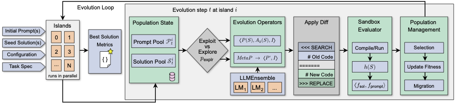

# CodeEvolve
```                                                                                                                                                                                                                                
                                         █████        █████                                         
                                     ██    ███████████████   ███                                    
                                  ██  ████████████ ███████████   ██                                 
                               ██  █████████████    ██████████████ ██                               
                             ██  ██████████████      ███████████████  █                             
                            █  ██████████  █████     ████  ███████████ ██                           
                          ██ ████████ ████ █   ██  ██   ██████  ███████  █                          
                         █  █████████    ███    █  █    ██ █    █████████ █                         
                        █  ██████████      █ █████ █████   █   ███████████ █                        
                       ██ █████████████████████ ██ ██ █████████████████████ █                       
                       █ ██████     █████  █   █ █  ██  ██  █████     ██████ █                      
                      █ ███████    ██ █   ██  ███  ███  ██   █████   ███████ █                      
                      █ ███████████████  █  ███  █ █ ███     ████████████████ █                     
                     █ ██████████     ██  █   ███   ██ █    ██     ██████████ █                     
                     █ ████████████   ███████ ███  ███████████    ███████████ █                     
                     █ ███████████████████      █  ██       █████████████████ █                     
                     █ ███████████   ██   ██████    ███████  ██   ███████████ █                     
                     █ ███████████████   ███████ ██  ██████   ███████████████ █                     
                     ██ ███████████████████████  ██  ████████████████████████ █                     
                      █ ██████████████████████  ████   ██████████████████ ██ ██                     
                      ██ █████████████████████  ████  ██████████████████████ █                      
                       █ ██████████████████████  ██  ██████████████████████ █                       
                        █ ██████████████████████ ██ ██████████████████████ ██                       
                         █ █████████████████████     ████████████████████ ██                        
                          █  ████████████████          █████████████████ ██                         
                           ██ ████ ██        █ ██  ██ █        ███████  █                           
                             ██ ███ ██ ███ ██ ██  █ █████ ███ ██ ████ ██                            
                               ██ ████████████    ██  ██ █████████  ██                              
                                 ██  ████  ████ █████ ████ █████ ██                                 
                                    ███  ███ ██████████ ████  ███                                   
                                        █████           █████                                       
                                                 ███                                                
                                                              
                                                                                                    
              ██████               ██         ██████                 ██                             
             ██    ██  █████   ██████  █████  ██      ██  ██  ████   ██ ██   ██  ████               
             ██       ██   ██ ██   ██ ██   ██ ██████  ██  █  ██   █  ██  ██ ██  █   ██              
             ██    ██ ██   ██ ██   ██ ██      ██       ████  ██   █  ██  ██ █  ██                   
               █████   █████   ██████  █████  ██████    ██    ████   ██   ███    ████               
                                                                                                 
```

<div align="center">
<p align="center">
  </a>
  <a href="https://arxiv.org/abs/2510.14150"></a>
  <a href="https://github.com/inter-co/science-codeevolve/blob/main/LICENSE"></a>
</p>

**An open-source framework that combines large language models with evolutionary algorithms to discover and optimize high-performing code solutions.**

</div>

CodeEvolve democratizes algorithmic discovery by making LLM-driven evolutionary search transparent, reproducible, and accessible. Whether you're tackling combinatorial optimization, discovering novel algorithms, or optimizing computational kernels, CodeEvolve provides a modular foundation for automated code synthesis guided by quantifiable metrics.

## Table of Contents

- [Why CodeEvolve?](#why-codeevolve)
- [Key Features](#key-features)
- [How It Works](#how-it-works)
- [Architecture](#architecture)
- [Performance Highlights](#performance-highlights)
- [Platform Support](#platform-support)
- [Quick Start](#quick-start)
- [Use Cases](#use-cases)
- [Reproducing Research Results](#reproducing-research-results)
- [Documentation](#documentation)
- [Contributing](#contributing)
- [Citation](#citation)

## Why CodeEvolve?

**State-of-the-art performance with transparency.** CodeEvolve matches or exceeds the performance of closed-source systems like Google DeepMind's AlphaEvolve on established algorithm-discovery benchmarks, while remaining fully open and reproducible.

**Cost-effective solutions.** Open-weight models like Qwen often match or outperform expensive closed-source LLMs at a fraction of the compute cost, making cutting-edge algorithmic discovery accessible to researchers and practitioners with limited budgets.

**Designed for real problems.** CodeEvolve addresses meta-optimization tasks where you need to discover programs that solve complex optimization problems—from mathematical constructions to scientific discovery.

## Key Features


### Islands-based Genetic Algorithm

Multiple populations evolve independently and periodically exchange top performers, maintaining diversity while propagating successful solutions across the search space. This parallel architecture enables efficient exploration and scales naturally to concurrent evaluation.

### Modular Evolutionary Operators

**Inspiration-based Crossover:** Contextual recombination that combines successful solution patterns while preserving semantic coherence. Parent solutions are presented to the LLM along with high-performing "inspiration" programs, allowing it to synthesize novel combinations.

**Meta-prompting Exploration:** Evolves the prompts themselves, enabling the LLM to reflect on and rewrite its own instructions for more diverse search trajectories. The system maintains a population of prompts that co-evolve with solutions.

**Depth-based Exploitation:** Targeted refinement mechanism that makes precise edits to promising solutions by maintaining conversation history. The LLM sees the full evolutionary lineage, enabling incremental improvements while preserving working components.

### Quality-Diversity Optimization

**MAP-Elites Integration:** Optional quality-diversity archive that maintains behavioral diversity across the solution space. Supports both grid-based and CVT-based (Centroidal Voronoi Tessellation) feature maps.

### Flexible LLM Integration

**Ensemble Support:** Mix and match multiple LLMs with weighted selection. Use different models for exploration vs. exploitation phases, or combine open-weight and proprietary models.

**OpenAI-Compatible APIs:** Works with any OpenAI-compatible endpoint including vLLM, Ollama, Together AI, and cloud providers.

## How It Works

CodeEvolve operates as a distributed evolutionary algorithm where code itself is the evolving entity:

### The Evolutionary Loop

1. **Initialization**: Start with an initial code template and system prompt that defines the task

2. **Selection**: Choose parent and inspiration programs based on fitness
   - **Exploration mode**: Random or uniform selection for broad search
   - **Exploitation mode**: Tournament or roulette selection for refinement

3. **Variation**: Generate new candidates through LLM-driven operations
   - **Exploration**: Broad modifications with meta-prompting
   - **Exploitation**: Targeted improvements with conversation history

4. **Code Generation**: LLM produces SEARCH/REPLACE diffs
   - Only specified code blocks are modified (between markers)
   - Preserves working code outside evolution zones
   - Applies structured diffs rather than regenerating entire files

5. **Evaluation**: Execute in a resource-contained temporary environment
   - Resource limits (time, memory)
   - Capture metrics and errors
   - Extract fitness from evaluation results

6. **Migration**: Periodically exchange top solutions between islands
   - Maintains diversity while spreading innovations
   - Prevents premature convergence

7. **Archiving** (optional): MAP-Elites maintains diverse solutions
   - Preserves behavioral variety
   - Increases diversity in a multi-objective setting

### Exploration vs Exploitation

The system dynamically balances exploration and exploitation:

| Phase | Selection | LLM Context | Operators |
|-------|-----------|-------------|-----------|
| **Exploration** | Random | Random Inspirations | Meta-prompting exploration |
| **Exploitation** | Fitness | Best Inspirations + Full lineage | Depth exploitation |

The exploration rate is controlled by a scheduler (e.g., exponential decay) and can adapt based on fitness improvements.

### Distributed Islands

```
┌─────────┐     ┌─────────┐     ┌─────────┐
│Island 0 │────▶│Island 1 │────▶│Island 2 │
│Pop: 20  │     │Pop: 20  │     │Pop: 20  │
└────┬────┘     └────┬────┘     └────┬────┘
     │               │               │
     └───────────────┴───────────────┘
        Periodic Migration
        
Each island maintains:
- Solution population
- Prompt population
- Local fitness rankings
- Migration history
```
### Core Components

#### CLI Entry Point (`cli.py`)
- Parses command-line arguments and orchestrates execution flow
- Validates environment, paths, and configuration
- Creates shared memory and synchronization primitives
- Coordinates island spawning, monitoring, and shutdown

#### Process Runner (`runner.py`)
- **Process Management**: Spawns and monitors island processes
- **Signal Handling**: Handles SIGTERM, SIGTSTP, SIGQUIT
- **Failure Recovery**: Detects crashed islands and terminates remaining processes
- **Log Daemon**: Manages centralized logging process

#### Evolution Engine (`evolution.py`)
- **Modular Design**: Main loop decomposed into specialized helper functions for selection, meta-prompting, code generation, evaluation, and migration
- Coordinates exploration/exploitation scheduling with adaptive rates
- Handles checkpoint creation and restoration with state consistency

#### Program Database (`database.py`)
- Manages populations with genealogical tracking and fitness rankings
- Implements multiple selection strategies
- Implements the MAP-Elites algorithm for improved diversity, with Classic grid-based archive and Central Voronoi Tesselations variant

#### Schedulers (`scheduler.py`)
- **ExponentialScheduler**: Exponential growth or decay over epochs (configurable via `weight`)
- **PlateauScheduler**: Adapts value based on fitness improvements (decrease on progress, increase on plateau)
- **CosineScheduler**: Cycles value using cosine annealing

Schedulers are used for both exploration rate and evaluation timeout scheduling.

#### Evaluator (`evaluator.py`)
- Sandboxed program execution with resource limits (time, memory)
- Multi-threaded memory monitoring with process tree management
- Isolated execution in temporary directories
- Structured metrics extraction from JSON results

#### Islands Coordinator (`islands/`)
- **Synchronization** (`sync.py`): Barriers, locks, and shared state for distributed coordination
- **Communication Graph** (`graph.py`): Flexible topologies (ring, star, complete, etc.)
- **Migration Logic** (`migration.py`): Threaded send/receive with barrier synchronization

#### LLM Interface (`lm/`)
- **Abstract Base Classes** (`base.py`): Clean interface for plugging in different LLM providers
- **OpenAI Wrapper** (`openai.py`): Async client with retry logic and ensemble support
- **Mock Models**: Set model_name to "MOCK" for debugging without API calls
- **Ensemble Support**: Weighted random selection from multiple models
- Embedding generation support for semantic search (optional)

#### Prompt Sampler (`prompt/`)
- **Sampler** (`sampler.py`): Builds conversation histories from program lineages for context-aware generation
- **Templates** (`template.py`): Predefined prompt templates for evolution and meta-prompting
- Incorporates inspiration programs for crossover operations
- **Meta-prompting**: Evolves the system prompts themselves for adaptive search
- Dynamic depth control for managing context length

#### Utilities (`utils/`)
- **Constants** (`constants.py`): Centralized magic constants (markers, file names, defaults)
- **Checkpointing** (`ckpt.py`): Save and load algorithm state
- **Configuration** (`cli_setup.py`): Validation, loading, and island argument setup
- **Parsing** (`parsing.py`): SEARCH/REPLACE diff application
- **Logging** (`logging.py`): Distributed logging with real-time CLI dashboard
- **Locking** (`lock.py`): Directory-level locks to prevent concurrent runs

## Performance Highlights

CodeEvolve demonstrates superior performance on several benchmarks previously used to assess AlphaEvolve:

- **Competitive or better results** across diverse algorithm-discovery tasks including autocorrelation inequalities, packing problems, and Heilbronn problems
- **Open-weight models** (e.g., Qwen) matching closed-source performance at significantly lower cost
- **Extensive ablations** quantifying each component's contribution to search efficiency

For comprehensive evaluation details and specific results, see CodeEvolve's [paper](https://arxiv.org/abs/2510.14150).

## Platform Support

CodeEvolve has been developed and tested on **Linux**. It may run on macOS and Windows, but the following features are Linux-specific and may behave differently or be unavailable on other platforms:

- **`taskset` CPU pinning** — used in `scripts/run.sh` to restrict the process to specific CPU cores. Not available on macOS or Windows; use `cpuset` or OS-level scheduling tools as alternatives.
- **Per-island CPU partitioning (`num_cpus_per_eval`)** — when set in `BUDGET_CONFIG`, CodeEvolve divides the available CPU cores into consecutive slices and pins each island process to its own slice via `os.sched_setaffinity`. This eliminates cross-island CPU contention and makes wall-clock evaluation time predictable. Requires Linux; the option is silently ignored on macOS and Windows with a warning printed at startup.
- **Resource monitoring** — the `resource_monitor` thread uses `psutil` to enforce memory and CPU-time limits. While `psutil` is cross-platform, CPU-time accounting for child processes may be less accurate on macOS and is unsupported on Windows.
- **Process tree management** — SIGTERM/SIGKILL-based process tree teardown behaves as expected on Linux; macOS behaves similarly, but Windows uses a different termination model.

If you encounter platform-specific issues, contributions and bug reports are welcome.

## Quick Start

### Installation

Clone this repository and create the conda environment:

```bash
git clone https://github.com/inter-co/science-codeevolve.git
cd science-codeevolve
conda env create -f environment.yml
conda activate codeevolve
```

### Basic Usage

Configure your LLM provider by setting environment variables:

```bash
export API_KEY=your_api_key_here
export API_BASE=your_api_base_url
```

> `API_BASE` must point to an **OpenAI-compatible** API base URL (hosted provider, gateway, or local inference server).

Run CodeEvolve via the command line:

```bash
codeevolve \
  --inpt_dir=INPT_DIR \
  --cfg_path=CFG_PATH \
  --out_dir=RESULTS_DIR \
  --load_ckpt=LOAD_CKPT \
```

**Arguments:**
- `--inpt_dir`: Directory containing the evaluation script and the initial codebase
- `--cfg_path`: Path to YAML configuration file (required for new runs)
- `--out_dir`: Directory where results will be saved
- `--load_ckpt`: Checkpoint to load (0 for new run, -1 for latest, or specific epoch)

The `scripts/run.sh` provides a bash script for running CodeEvolve with `taskset` to limit CPU usage. See `src/codeevolve/cli.py` for further details.

### Minimal Example

Here's a complete minimal example for optimizing a simple function:

**1. Create problem directory:**
```bash
mkdir -p my_problem/input
```

**2. Create initial solution (`my_problem/input/solution.py`):**
```python
# EVOLVE-BLOCK-START
def objective(x):
    """Function to maximize."""
    return -(x - 3)**2 + 10
# EVOLVE-BLOCK-END

if __name__ == '__main__':
    x = 0.0  # Initial guess
    result = objective(x)
    print(f"Result: {result}")
```

**3. Create evaluator (`my_problem/input/evaluate.py`):**
```python
import sys
import json
import subprocess

def evaluate(code_path, results_path):
    # Run the solution
    result = subprocess.run(
        [sys.executable, code_path],
        capture_output=True,
        text=True,
        timeout=10
    )
    
    # Extract fitness from output
    fitness = float(result.stdout.split(':')[1].strip())
    
    # Save results
    with open(results_path, 'w') as f:
        json.dump({'fitness': fitness}, f)

if __name__ == '__main__':
    evaluate(sys.argv[1], sys.argv[2])
```

**4. Create config (`my_problem/config.yaml`):**
```yaml
SEED: 42

CODEBASE_PATH: "."
EVAL_FILE_NAME: "evaluate.py"

INIT_FILE_DATA:
  filename: "solution.py"
  language: "python"

SYS_MSG: |
  # PROMPT-BLOCK-START
  You are an expert optimization algorithm designer. Your goal is to modify
  the given code to maximize the objective function.
  # PROMPT-BLOCK-END

BUDGET_CONFIG:
  eval_timeout: 10
  max_mem_bytes: 1000000000
  resource_check_interval_s: 0.1

ENSEMBLE:
  - model_name: "meta-llama/Meta-Llama-3.1-8B-Instruct-Turbo"
    temp: 0.8
    weight: 1
    seed: 42

SAMPLER_AUX_LM:
  model_name: "meta-llama/Meta-Llama-3.1-8B-Instruct-Turbo"
  temp: 0.7
  seed: 42

EVOLVE_CONFIG:
  num_epochs: 50
  num_islands: 2
  migration: {topology: "directed_ring", interval: 10, rate: 0.1}

  selection: {policy: "tournament", kwargs: {tournament_size: 3}}

  num_inspirations: 2
  exploration_rate: 0.3

  fitness_key: "fitness"
  ckpt: 10
  early_stopping_rounds: 20
```

**5. Run:**
```bash
codeevolve \
  --inpt_dir=my_problem/input \
  --cfg_path=my_problem/config.yaml \
  --out_dir=my_problem/results \
```

### Customizing for Your Problem

CodeEvolve is designed for algorithmic problems with quantifiable metrics. To apply it to your domain:

1. **Define your evaluation function** that measures solution quality
   - Must accept: code file path, results file path
   - Must output: JSON with at least one metric field

2. **Specify the initial codebase** or problem structure
   - Mark evolution zones with `# EVOLVE-BLOCK-START` and `# EVOLVE-BLOCK-END`
   - Code outside these blocks is preserved

3. **Configure evolutionary parameters**
   - Population size, mutation rates, selection policy
   - Exploration/exploitation balance
   - Migration topology and frequency

4. **Choose your LLM ensemble composition**
   - Single model or multiple models
   - Separate ensembles for exploration vs exploitation
   - Weight distribution across models

See `problems/problem_template` for a general template. Comprehensive tutorials and example notebooks will be released soon.

## Use Cases

The framework is suitable for any domain where solutions can be represented as code and evaluated programmatically:

### Mathematical Discovery
- Finding solutions to open problems in mathematics
- Discovering new inequalities or bounds
- Constructing optimal geometric configurations

### Algorithm Design
- Optimizing computational kernels and scheduling algorithms
- Discovering novel heuristics for NP-hard problems
- Automated algorithm configuration

### Scientific Discovery
- Exploring hypothesis spaces expressed as executable code
- Parameter optimization for scientific models
- Automated experimental design

### Software Optimization
- Performance tuning of critical code paths
- Automatic parallelization strategies
- Resource allocation optimization

## Reproducibility & Determinism

CodeEvolve is designed to be **seedable for all internal algorithmic decisions** (selection, scheduling, migration, etc.). However, **exact end-to-end reproducibility depends on your LLM provider**:

- **Framework-level seeding**:
  - Set `SEED` in the YAML config to seed internal randomness.
  - In multi-island runs, each island derives a deterministic island seed (`SEED + island_id`) for its local stochastic decisions.
- **LLM seeding**:
  - Model configs can include a `seed` field, and CodeEvolve forwards it to OpenAI-compatible APIs.
  - Some providers do **not** support deterministic sampling and may ignore `seed` or still return nondeterministic outputs.

For hosted LLM APIs, treat results as **statistical**—run multiple seeds and compare distributions. If you use a fully controlled inference stack that supports deterministic decoding, you may get much closer to exact replay.

## Experiments on benchmarks

For complete experimental configurations, benchmark implementations, and step-by-step examples demonstrating how to run CodeEvolve on various problems, visit the experiments repository:

**[github.com/inter-co/science-codeevolve-experiments](https://github.com/inter-co/science-codeevolve-experiments)**

This companion repository contains all code necessary to reproduce the results from CodeEvolve's [paper](https://arxiv.org/abs/2510.14150), including:

- Experimental configurations for each problem
- Raw results and checkpoints from paper runs
- Analysis notebooks with visualizations
- Comparisons with AlphaEvolve

## Documentation

### Configuration Reference

Key configuration parameters in your YAML file:

```yaml
# Resource limits and timeout scheduling
BUDGET_CONFIG:
  eval_timeout: 60               # Static evaluation timeout (seconds)
  max_mem_bytes: 1000000000      # Memory limit (~1 GB)
  resource_check_interval_s: 0.1     # Resource (memory/CPU) polling interval
  # Optional (Linux only): pin each island to N dedicated CPU cores.
  # Total cores reserved = num_cpus_per_eval × num_islands.
  # Omit or set to null to let all islands share CPUs freely.
  # num_cpus_per_eval: 2
  # Optional: adaptive timeout scheduling (overrides eval_timeout)
  timeout_scheduler:
    type: "ExponentialScheduler"
    kwargs: {min_value: 5, max_value: 60, weight: 1.05}

EVOLVE_CONFIG:
  # Basic settings
  num_epochs: 100              # Total iterations
  num_islands: 4               # Parallel populations
  init_pop: 20                 # Initial population per island
  max_size: 50                 # Max population size (null = unlimited)

  # Selection
  selection:
    policy: "tournament"       # or "roulette", "random", "best"
    kwargs: {tournament_size: 3}

  # Exploration/Exploitation
  exploration_rate: 0.3        # Probability of exploration
  # Optional: adaptive exploration rate scheduling (presence enables it)
  exploration_scheduler:
    type: "PlateauScheduler"
    kwargs: {min_value: 0.2, max_value: 0.5, plateau_threshold: 5,
             increase_factor: 1.05, decrease_factor: 0.95}

  # Operators
  num_inspirations: 3          # Inspiration programs for crossover
  meta_prompting: true         # Enable prompt evolution
  max_chat_depth: 5            # Conversation history depth

  # Migration
  migration:
    topology: "directed_ring"  # Island topology
    interval: 20               # Epochs between migrations
    rate: 0.1                  # Fraction to migrate

  # Block markers (optional, defaults shown)
  markers:
    evolve_start_marker: "# EVOLVE-BLOCK-START"
    evolve_end_marker: "# EVOLVE-BLOCK-END"
    mp_start_marker: "# PROMPT-BLOCK-START"
    mp_end_marker: "# PROMPT-BLOCK-END"

  # Quality-Diversity (optional)
  use_map_elites: false        # Enable MAP-Elites

  # Checkpointing
  ckpt: 10                     # Checkpoint frequency
  early_stopping_rounds: 50    # Stop after N epochs without improvement

  # Fitness
  fitness_key: "fitness"       # Metric name from evaluation JSON
```

### Command-Line Reference

```bash
codeevolve [OPTIONS]

Required:
  --inpt_dir PATH          Input directory with solution and evaluator
  --out_dir PATH           Output directory for results

Optional:
  --cfg_path PATH          Config file (required for new runs)
  --load_ckpt INT          Checkpoint: 0=new, -1=latest, N=epoch N
```

### Output Structure

```
output_directory/
├── config.yaml              # Copy of configuration used
├── 0/                       # Island 0 results
│   └── logs/                # Logs
│       ├── run_1.log
│       ├── run_2.log
│       └── ...
│   ├── best_sol.py          # Best solution found
│   ├── best_prompt.txt      # Best prompt evolved
│   └── ckpt/                # Checkpoints
│       ├── ckpt_10.pkl
│       ├── ckpt_20.pkl
│       └── ...
├── 1/                       # Island 1 results
│   └── ...
└── ...
```

## Releases

We organize the different versions of CodeEvolve as releases in both this repository and its companion experiments repository. Currently, we have the following releases:

1. **v0.1.0**: Initial version of CodeEvolve, corresponds to v1 of CodeEvolve's [paper](https://arxiv.org/abs/2510.14150).
2. **v0.2.0** / **v0.2.1**: Corresponds to v3 of CodeEvolve's [paper](https://arxiv.org/abs/2510.14150) with minor bug fixes.
3. **v0.3.0**: Most recent release, with major quality of life improvements and code refactoring.

## Contributing

We welcome contributions from the community! Here's how to get involved:

1. **Start with an issue:** Browse [existing issues](https://github.com/inter-co/science-codeevolve/issues) or create a new one describing your proposed change

2. **Submit a pull request:** 
   - Fork the repository
   - Create a feature branch
   - Make your changes with tests
   - Reference the issue in your PR description

3. **Keep PRs focused:** Avoid massive changes—smaller, well-tested contributions are easier to review

4. **Maintain quality:** Ensure code is tested, documented, and follows existing style

Please refer to `CONTRIBUTING.md` for detailed guidelines.

### Areas for Contribution

- **New selection policies** or evolutionary operators
- **Additional LLM providers** and integrations
- **Benchmark problems** from your domain
- **Documentation** improvements and tutorials
- **Performance optimizations**
- **Bug fixes** and test coverage

## Citation
```bibtex
@article{assumpção2025codeevolveopensourceevolutionary,
      title={CodeEvolve: An open source evolutionary coding agent for algorithm discovery and optimization},
      author={Henrique Assumpção and Diego Ferreira and Leandro Campos and Fabricio Murai},
      year={2025},
      eprint={2510.14150},
      archivePrefix={arXiv},
      primaryClass={cs.AI},
      url={https://arxiv.org/abs/2510.14150},
}
```

## Acknowledgements

The authors thank Bruno Grossi for his continuous support during the development of this project. We thank Fernando Augusto and Tiago Machado for useful conversations about possible applications of CodeEvolve. We also thank the [OpenEvolve](https://github.com/codelion/openevolve) community for their inspiration and discussion about evolutionary coding agents.

## License and Disclaimer

All software is licensed under the Apache License, Version 2.0 (Apache 2.0); you may not use this file except in compliance with the Apache 2.0 license. You may obtain a copy of the Apache 2.0 license at: https://www.apache.org/licenses/LICENSE-2.0.

**This is not an official Inter product.**
